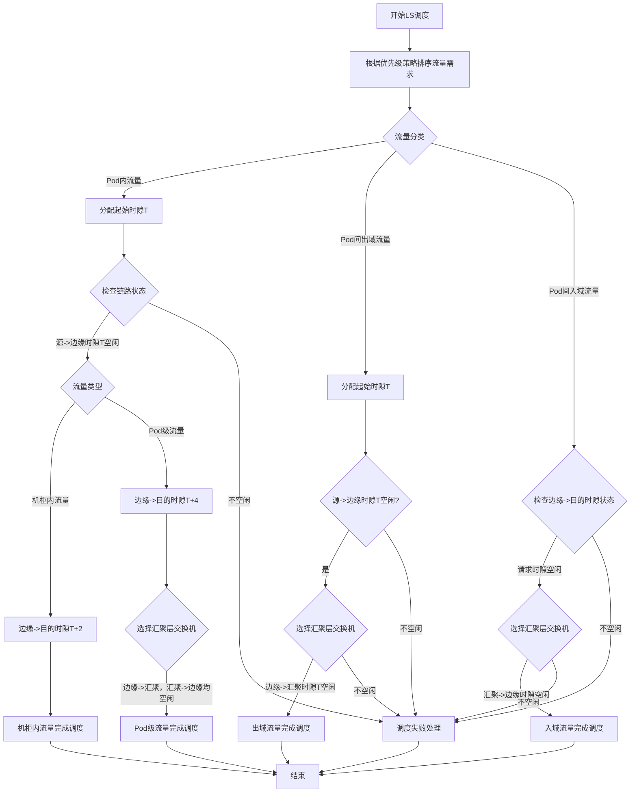

```mermaid
graph TD
    Start[开始LS调度] --> Sort[根据优先级策略排序流量需求]
    Sort --> Classify{流量分类}
    
    Classify -->|Pod内流量| A1[分配起始时隙T]
    A1 --> A2{检查链路状态}
    A2 -->|源->边缘时隙T空闲| A3{流量类型}
    A3 -->|机柜内流量| A4[边缘->目的时隙T+2]
    A3 -->|Pod级流量| A5[边缘->目的时隙T+4]
    A5 --> A6{选择汇聚层交换机}
    A6 -->|边缘->汇聚，汇聚->边缘均空闲| A7[Pod级流量完成调度]
    A4 --> A8[机柜内流量完成调度]
    
    Classify -->|Pod间出域流量| B1[分配起始时隙T]
    B1 --> B2{源->边缘时隙T空闲?}
    B2 -->|是| B3{选择汇聚层交换机}
    B3 -->|边缘->汇聚时隙T空闲| B4[出域流量完成调度]
    
    Classify -->|Pod间入域流量| C1{检查边缘->目的时隙状态}
    C1 -->|请求时隙空闲| C2{选择汇聚层交换机}
    C2 -->|汇聚->边缘时隙空闲| C3[入域流量完成调度]
    
    A2 -->|不空闲| Reject[调度失败处理]
    B2 -->|不空闲| Reject
    B3 -->|不空闲| Reject
    C1 -->|不空闲| Reject
    C2 -->|不空闲| Reject
    
    A7 --> End[结束]
    A8 --> End
    B4 --> End
    C3 --> End
    Reject --> End
```